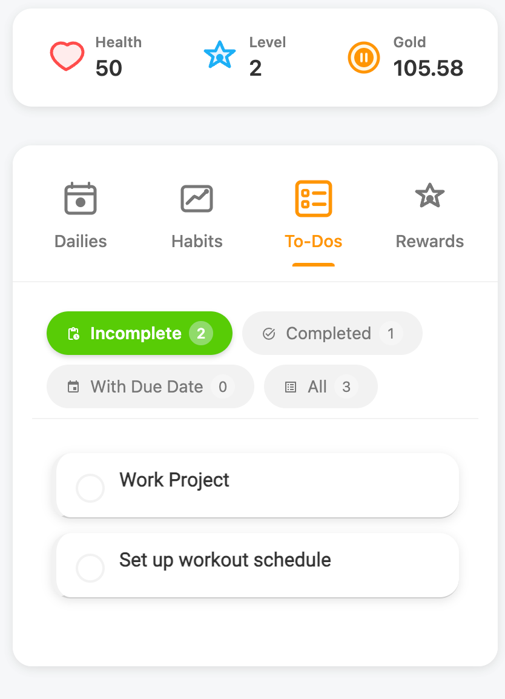

# Habitica Sync Duolingo in Obsidian

## What's New
This fork enhances the original Habitica Sync plugin with the following improvements:

1. **Duolingo-style UI**: Refreshed interface with a cleaner, more modern design inspired by Duolingo
2. **Multilingual Support**: Added support for both English and Chinese
   
   - English interface:  
   
   
  
   - Chinese interface:  
   
   
3. **Bug Fixes**: Fixed various issues to improve stability and performance

*Special thanks to the original author [LeoAndRan](https://ko-fi.com/leonardandran) for creating this amazing plugin!*

---

This plugin for Obsidian incorporates a view to display and interact with the task management app Habitica.

Please open issues for any bugs/functionality requests :)

## Usage
The plugin's view is enabled by clicking on the "Open Habitica Pane" option in the side ribbon (default hotkey is `Ctrl+Shift+H`). 

To sync your Habitica account, go to the settings page of the plugin and enter your user ID and API token credentials.
## Features
### Pane View
#### View stats (HP, XP, coins)
#### Views
Task Information:
- Title, description, subtasks
  - Markdown and emoji support

Tabs:
- To Do's
	- Active/Completed
- Dailies
	- Due/Not Due/Completed
	- 
- Habits
	- 
- Rewards
#### Interactivity
- Check off tasks/dailies in the view
	- Can uncheck completed habits/todos
	- 
- modify habit counters (+/-)

### Settings

The following two inputs help fetch your user data to be displayed in the Obsidian view:
- **Habitica User ID:** You can find this by clicking on the "User" icon in the top right of the Habitica webapp, "Settings", then "API"
- **Habitica Token API:** You can find this by clicking on the "User" icon in the top right of the Habitica webapp, "Settings", then "API"
- **Show Task Descriptions:** Toggles whether description/notes for tasks will be shown or not
- **Show Subtasks:** Toggles whether subtasks for to do's/dailies will be shown or not

## Roadmap

*Feel free to support us and donate!*

<a href='https://ko-fi.com/leonardandran' target='_blank'>

